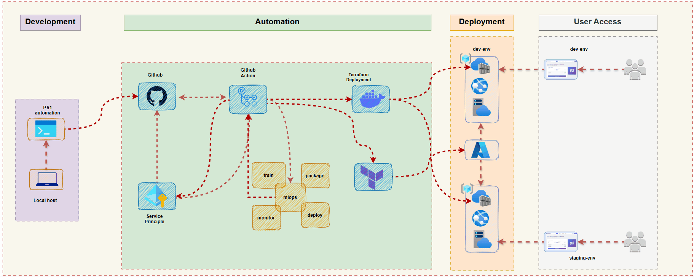
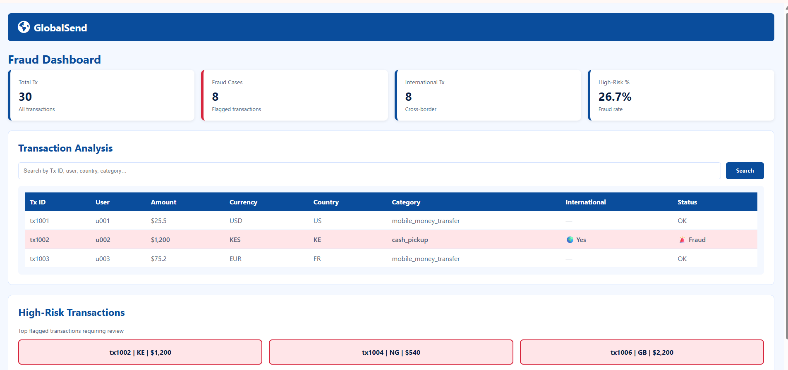

---

# 🌐 GlobalSend Fraud Dashboard

**Automated Multi‑Environment Deployment | Flask, ML, Docker, Azure, Terraform, GitHub Actions**

 
 
 
 
 


---

## 🚀 Overview

GlobalSend Fraud Dashboard is a **full‑stack monitoring platform** designed to analyse money‑transfer activity and identify potentially fraudulent behaviour using a **RandomForest machine‑learning model**.

The application is **fully containerised** and deployed to **Azure App Service** across Development, Staging, and Production environments. Infrastructure is provisioned using **Terraform**, and deployments are orchestrated through a **branch‑aware GitHub Actions pipeline**.

**Highlights:**

- Real‑time visibility of transactions, fraud indicators, and high‑risk alerts  
- Predictable, secure, and scalable multi‑environment deployment  
- Automated ML model training and packaging  
- Reproducible infrastructure via Terraform  
- Zero‑downtime Production releases using Blue‑Green deployment  

---

## 🏗 Architecture

**End‑to‑End Flow:**  
Local Development → GitHub → GitHub Actions → OIDC / Service Principal → Terraform → Dev → Staging → Production → End Users
 
### Architecture Diagram
 


---

### Fraud Dashboard


     

---

---

## ⚡ Key Components

| Component           | Technology                | Purpose                                             |
| ------------------- | ------------------------- | --------------------------------------------------- |
| Backend API         | Flask, Pandas, Joblib     | Serves transaction data and fraud predictions       |
| ML Model            | Scikit‑learn RandomForest | Identifies high‑risk transactions                   |
| Frontend Dashboard  | HTML5, CSS3, JavaScript   | Interactive visualisation and reporting             |
| Containerisation    | Docker                    | Standardised runtime for the application            |
| Infrastructure      | Terraform                 | Azure resource provisioning                         |
| Hosting             | Azure App Service         | Managed web hosting                                 |
| CI/CD Pipeline      | GitHub Actions            | Automated, branch‑aware deployment                  |
| Deployment Strategy | Blue‑Green                | Zero‑downtime Production releases                   |
| Automation Scripts  | PowerShell / Bash         | Local validation and environment promotion          |

---

## 🔧 Multi‑Environment Strategy

| Environment | Branch    | Deployment Trigger             |
| ----------- | --------- | ------------------------------ |
| Development | `dev`     | Push to `dev`                  |
| Staging     | `staging` | Merge `dev` → `staging`        |
| Production  | `main`    | Blue‑Green deployment on merge |

**Pipeline Features:**

- Automatic environment detection based on branch  
- OIDC authentication for Development  
- Service Principal authentication for Staging and Production  
- Automated Terraform `plan` and `apply`  
- Integrated ML model training and Docker build  
- Blue‑Green swap for seamless Production releases  

---

## 🗂 Project Structure

```
globalsend-fraud-dashboard/
├── app/                      # Flask backend & frontend
│   ├── app.py
│   ├── fraud_model.pkl
│   ├── requirements.txt
│   └── static/
│       ├── index.html
│       ├── styles.css
│       └── script.js
├── ml/data/                  # Sample data & training script
│   ├── transactions-sample.csv
│   └── train.py
├── docker/                   # Dockerfile
│   └── Dockerfile
├── terraform/                # Infrastructure as Code
│   ├── main.tf
│   └── modules/
│       ├── acr/
│       └── app-service/
├── .github/workflows/        # CI/CD pipeline
│   └── deploy.yml
└── README.md
```

---

## 🛡 Security & Best Practice

- **Environment Isolation:** Dedicated Azure resources per environment  
- **Credential Management:** OIDC for Dev; Service Principals for Staging/Prod  
- **Network Security:** Azure App Service built‑in protections  
- **Container Security:** Reproducible Docker images  
- **IaC Validation:** Terraform plans ensure predictable changes  

---

## 📝 Usage

### Local Development

```bash
git clone <repo-url>
cd globalsend-fraud-dashboard
python -m venv venv
source venv/bin/activate  # Windows: venv\Scripts\activate
pip install -r app/requirements.txt
python app/app.py
```

Visit: `http://127.0.0.1:80` [(127.0.0.1 in Bing)](https://www.bing.com/search?q="http%3A%2F%2F127.0.0.1%2F")

### Train the ML Model

```bash
python ml/data/train.py
```

### Docker

```bash
docker build -f docker/Dockerfile -t globalsend-site .
docker run -p 80:80 globalsend-site
```

### Azure Deployment

```bash
cd terraform
terraform init
terraform apply -auto-approve -var="environment=dev"

docker build -t <ACR_LOGIN_SERVER>/globalsend-site:v3 .
docker push <ACR_LOGIN_SERVER>/globalsend-site:v3
```

---

## 👨‍💻 Tech Stack

- **Backend:** Flask, Pandas, Joblib  
- **Machine Learning:** Scikit‑learn RandomForest  
- **Frontend:** HTML, CSS, JavaScript  
- **Containerisation:** Docker  
- **Cloud & IaC:** Azure App Service, ACR, Terraform  
- **CI/CD:** GitHub Actions, PowerShell  

---

## 📬 Contact

For queries regarding the DevOps pipeline or cloud architecture, please contact the **GlobalSend DevOps Team**.

---

## 📜 Licence

Licensed under the **MIT Licence**  
_Last updated: February 2026_

---

